[TOC]

# 嵌入式低功耗 Wi-Fi 物联网报警系统——基于 TI 的 CC3200

本设计以 TI 的 CC3200 微控制器为核心，实现了一种基于低功耗 Wi-Fi 的 Internet 报警系统。该系统主要由基于 CC3200 的 Wi-Fi 报警装置、无线路由器、云服务平台、智能手机客户端组成。Wi-Fi 报警装置上的三轴加速度传感器，通过相关算法实时对物体的加速度信息进行监控，判断出震动、运动状态等，并将相关的报警信息通过无线路由器转发至云服务平台，最终由云服务平台将报警信息推送到已绑定的用户手机来进行相关的报警操作。本系统充分利用了 CC3200 的低功耗、嵌入式 Wi-Fi SoC 的特点，具有成本低、部署简单、扩展灵活、实时性高等优势，可广泛用于各种室内防盗、监控领域。


# 系统方案设计

嵌入式低功耗 Wi-Fi 实时报警系统，主要由若干个Wi-Fi报警装置、无线路由器网关、嵌入式云服务平台、智能终端共同组成。

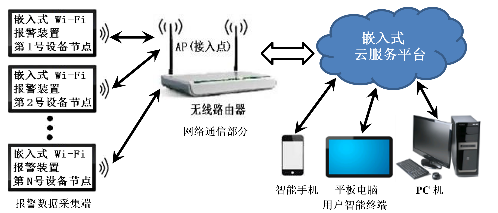


## 嵌入式 Wi-Fi 报警装置

嵌入式 Wi-Fi 报警装置主要由带有 Wi-Fi 射频前端的低功耗微控制器 CC3200 和三轴加速度传感器构成。利用三轴加速度传感器对被测物体的位移信息进行采集。TI CC3200 微控制器主要是利用其片上的 Wi-Fi 通信模块，实现报警装置与物联网云服务平台的信息交互，并充分利用 CC3200 微控制器的低功耗特性，尽可能降低设备的功耗。

## 无线路由器网关

无线路由器网关采用了家庭常用的无线路由器，主要用于将报警器的报警信息转发到云服务平台。

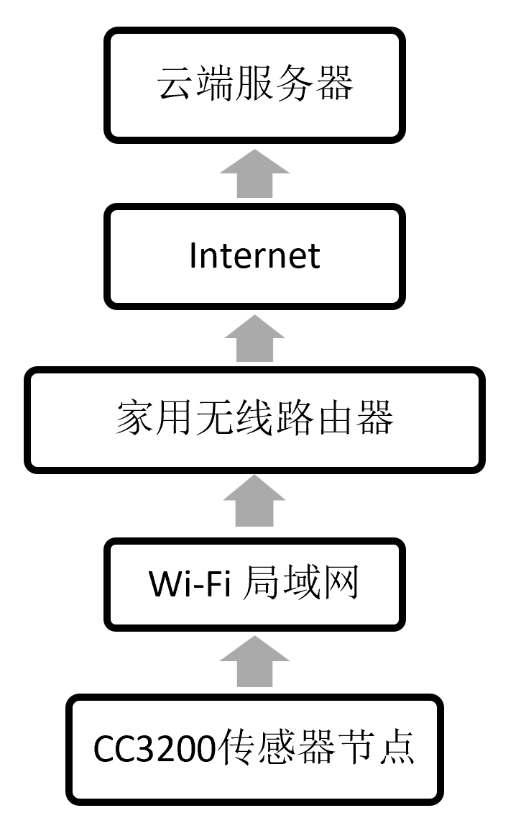

## 嵌入式云服务平台

嵌入式云服务平台通过为用户提供完整的系统 API 接口， 实现与嵌入式终端设备的数据通信。当各种设备实现网络化后，设备将自动链接至云服务器。同时，用户可以通过 PC 机、智能手机等访问云服务网站，实时查看嵌入式终端设备的相关数据，并对其进行监控。

其主要功能包括：

- 实时数据交互——在嵌入式设备和应用之间, 提供多种格式的双向实时数据交互。

- 监控与数据分析——自定义通知和提醒规则；历史数据为数据分析提供支持。

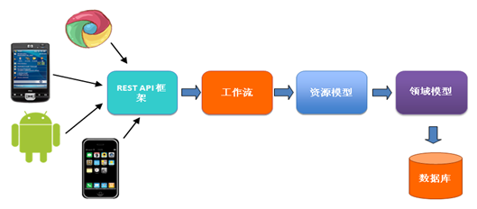

## 智能终端

通过智能终端的客户端应用程序的开发，实现智能终端与云服务器之间的数据交互，然后通过云服务器，实现智能终端在 Wi-Fi 和 3G/4G 两种无线网络环境下，可以随时随地对多个报警装置进行实时监控。此次设计将利用Android智能手机开发平台，开发一款手机客户端应用软件（APP）。


# 系统硬件的设计与实现

报警装置的主控芯片为 CC3200 微控制器，由电源模块、加速度传感器模块、Wi-Fi 无线通信模块、串行通讯模块、JATG 仿真调试模块、以及 LED 指示灯和按键等部分组成。该报警系统的硬件结构较为简单，并且免去了过多的硬件，减少了用户的成本，价格较为低廉。

- 利用三轴加速度传感器，实现对物体位移信息的实时监控
- 在资源有限的MCU上，实现 Wi-Fi 通信及其相关应用
- 嵌入式 Wi-Fi 低功耗特性的实现（低功耗软件框架）
- 利用 NFC 技术，实现智能终端与 MCU 的信息交互
- Wi-Fi报警装置与云服务器（云端）的信息交互 
- 云服务器（云端）与智能终端（手机）的信息交互

## CC3200 报警装置的硬件总体结构框图

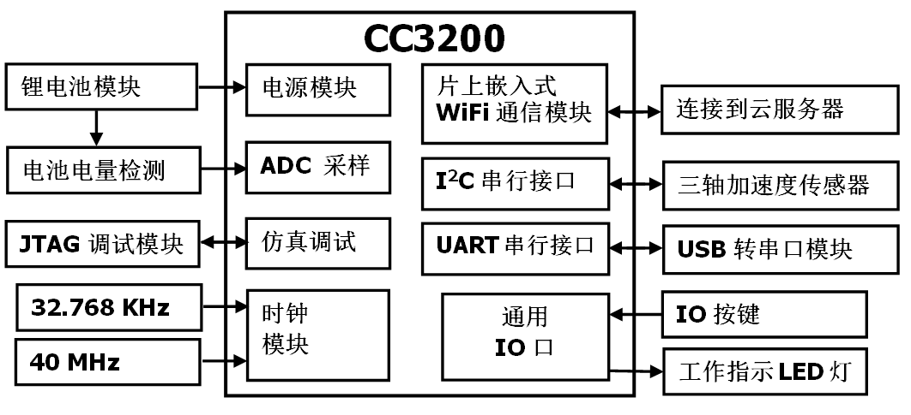

报警装置硬件模块按功能可分为：

- 电源管理模块：锂电池电量检测、锂电池充放电管理。

- 数据采集模块：三轴加速度传感器模块，用于实时采样物体的加速度信息。

- 数据传输通信模块：CC3200 集成的 Wi-Fi 模块，实现与云服务器的数据交互。

## CC3200  Wi-Fi SoC 微控制器 

### CC3200 微控制器的结构

美国TI公司推出的 CC3200 微控制器，是一款专门针对物联网 (IOT) 应用的32位低功耗微控制器。该芯片集成了最新ARM Cortex-M4 内核的应用微控制器子系统、Wi-Fi 网络处理器子系统和电源管理子系统，具有高速度、低工作电压、超低功耗、模块化控制灵活等技术特点。

此芯片包含多种外设，其中包括4个通用定时器、1 个看门狗定时器、4路12位模数转换器 (ADC)、2个通用异步收发器（UART）、1个 SPI 接口、1个 I2C 接口、8 位并行摄像头接口、2 个 I2S 通信接口和 1 个 SD/MMC接口，另外还包含了用于代码和数据的灵活嵌入式 RAM（高达 256 KB），以及具有外部串行闪存引导加载程序和外设驱动程序的 ROM。


### ARM Cortex-M4 内核

微控制器子系统包含一个运行频率为 80MHz 的行业标准 ARM Cortex-M4 内核。ARM Cortex-M4 内核属于 ARM V7 架构，是由 ARM 专门开发的最新 32 位嵌入式处理器，具有高效的信号处理功能与 Cortex-M4 处理器系列的低功耗、低成本和易于使用等优点。

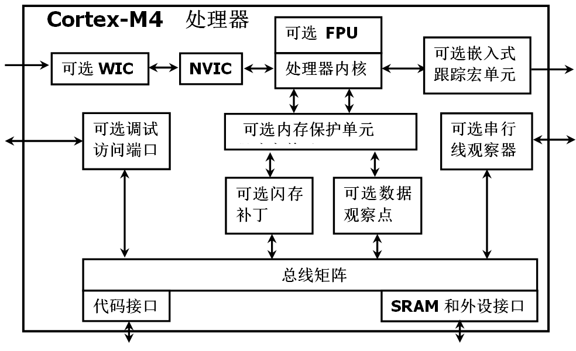

### 片上 Wi-Fi 网络处理器子系统:

- 具有802.11 b/g/n 射频、基带；
- 具有强大加密引擎，以实现支持 256 位加密的快速、安全Wi-Fi和互联网连接；
- 具有嵌入式TCP/IP 堆栈，拥有行业标准 BSD 套接字应用编程接口 (API)；
- 具有嵌入式HTTP 服务器和多个互联网协议。
- 支持Station（节点）、AP（无线接入点）和 Wi-Fi 直接模式；
- 支持 WPA2 个人和企业安全性以及 WPS2.0；
- 具有自主和快速 Wi-Fi 连接的 SimpleLink 连接管理器；
- 具有SmartConfig技术、AP模式、WPS技术，可简单且灵活地配置网络参数；
- Tx 功率：18.0 dBm @ 1 DSSS、14.5 dBm @ 54 OFDM；
- RX 灵敏度：-95.7 dBm @ 1 DSSS、-74.0 dBm @ 54 OFDM。


## 电源模块设计

此次设计将使用型号为 603048A 的锂电池对报警装置进行供电，并且可通过 USB 供电和对锂电池充电。其中，电源模块的充电管理芯片采用 TI 公司的 BQ24230 芯片。另外，由于锂电池的电压一般为 3V 到 4.2V，而报警装置的正常供电电压为 3.3V，故在锂电池的电压的输出端，还要加一个 3.3 V 升压降压转换器。此次设计采用的 3.3 V 升压降压转换器，采用的是 TI 公司的 TPS63001 芯片。

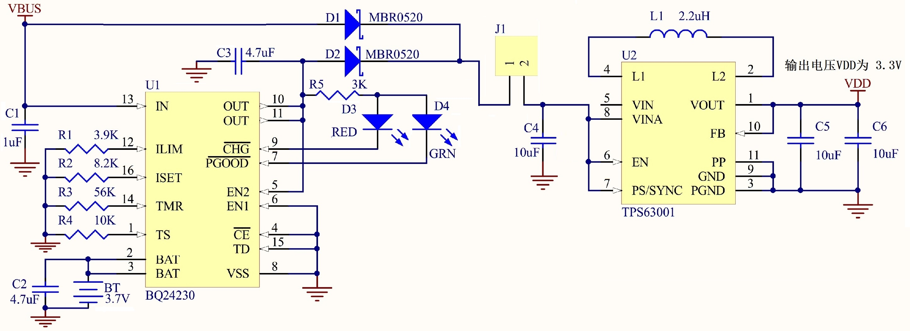

## 加速度传感器模块

此次设计中将使用电容式的加速度传感器，最后选择 Bosch（博世）公司的 BMA222 三轴加速度传感器。加速度传感器和微控制器之间的电路连接非常简单，论文中将使中 I2C 串行通信接口对 BMA222 进行寄存器读/写等相关操作。

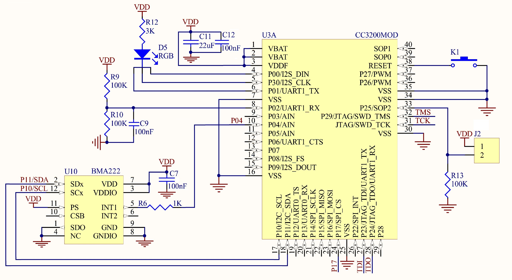


# 系统软件的设计与实现

系统软件是此次设计的核心部分，此次设计将采用模块化的设计方法。如图7系统软件的总体框图所示，整个报警系统的软件设计可分为三部分：

- 报警装置（嵌入式设备客户端）软件。
- 嵌入式云服务器软件。
- Android 手机客户端软件。


## 报警装置嵌入式软件的设计与实现

### 报警装置驱动软件主要模块

报警装置驱动软件主要包括以下几个部分：

- 三轴加速度传感器的驱动设计；

- 嵌入式 Wi-Fi 无线通信的实现；

- 嵌入式网络传输协议的实现；

- 嵌入式设备的低功耗软件设计与实现。

### 嵌入式软件开发环境说明

- 操作系统：windows 10；

- 开发工具：IAR Embedded Workbench for ARM 集成编译调试开发环境；

- CC3200 开发工具包：CC3200SDK-0.5.2.0；

- CC3200 代码下载工具：uniflash_cc3xxx_setup_3.2.0.00065；

- 软件编程：采用 C 语言实现；

- 软件的编辑环境：SourceInsight（面向项目开发的程序编辑器及代码浏览器）。

### 报警装置嵌入式软件的主程序流程图

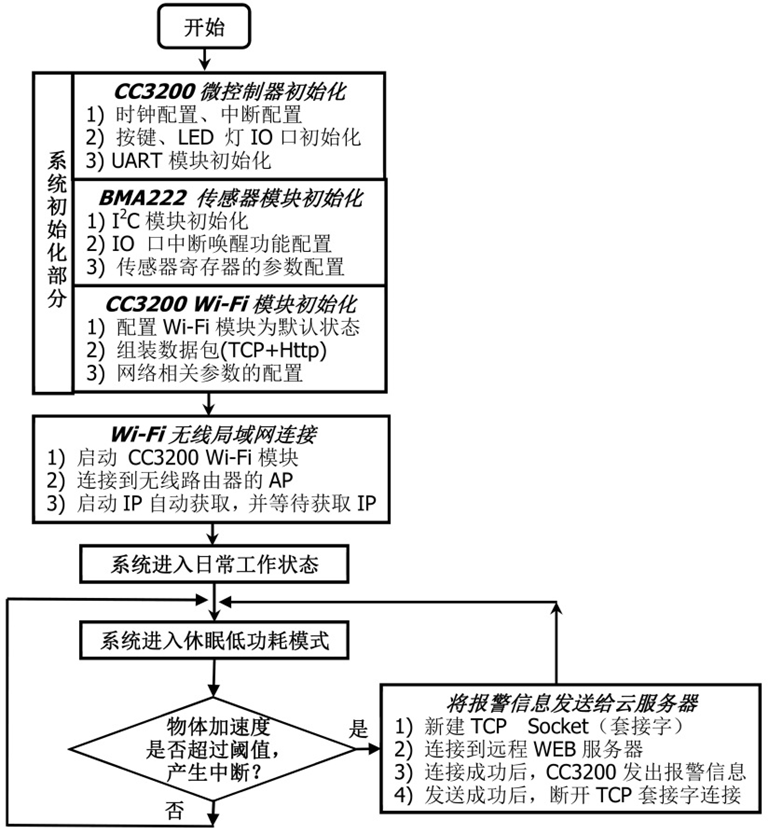

### **主要程序代码及程序注释**

```c
int main (void)
{
//==**(1) 系统初始化部分**==========================//
	  //--**禁用: 系统总中断**-------------------------//
	system_interrupt_disable_global();  //禁用: 系统总中断

	  //--**CC3200 微控制器初始化+时钟配置**----//
	system_Initial();    // CC3200 微控制器初使化 
	configure_clock();   // 配制CC3200 微控制器的系统时钟

      //--**用户按键、LED 灯IO口初始化**-----------//
	user_keys_init() ;      //用户按键IO口初始化
	leds_init();           // LED 灯IO口初始化

	  //--**BMA222 加速度传感器模块初始化**------//
	configure_i2c_master();  //配置: CC3200的 I2C串口通信模块(用于与BMA222通信)
	io_Interrupt_Initial();    //初使化: CC3200 的IO 口中断唤醒功能
	bma222_init();         //初始化bma222传感器的内部寄存器 

	  //--**CC3200片内UART 模块初始化**--------------//
	uart_config();  //初始化: UART模块(串口输出Wi-Fi的调试信息)

	  //--**CC3200片内Wi-Fi 模块相关的初始化**----//
	WiFi_Initial();        //初始化CC3200 Wi-Fi模块(配置CC3200恢复到其默认的状态)
	WiFi_Combined_Data_Packet();  // 组装数据包(TCP+Http)
	AppVariables_Initial();          //初始化相关变量(网络相关的变量:IP、端口号、SSID等)
	system_interrupt_enable_global();  //使能:系统总中断

//==**(2) Wi-Fi无线局域网连接部分**==================//
	  //--**配置CC3200片内Wi-Fi 模块**-----------------//
	WiFi_Start();  //启动 CC3200 片内Wi-Fi模块
	WiFi_Connect_To_AP();  //将报警装置连接到无线路由器的AP（WLAN）

	  //--**连接成功后，初始化状态机的状态值**--//
	WorkState = WORK_LowPower;  //进入日常工作后，系统自动进入低功耗模式，等待报警

//==**(3) 系统进入日常工作部分(低功耗软件结构)**======//
	//在没有报警触发时，系统一直处于低功耗状态
	//有报警时，系统被中断唤醒，将报警信息发给云服务器之后，再返回休眠状态。
	while (1)
	{
		switch(WorkState)   //状态机: "处理"各工作Work"状态"下的事务
		{
			case WORK_Test_IdleState:  //Work="测试时"的空闲状态
				break;

			case WORK_ReadAllVaule_BMA222:  //Work=读取BMA222所有加速度数据
				ReadAllEventVaule_BMA222();      //读取BMA222所有加速度数据
				WorkState = WORK_Test_IdleState;   //返回到状态: 
				break;

			case WORK_Alarm:        //Work=报警 (工作时)
				   	//新建TCP  Socket 套接字；
					//连接到远程WEB服务器(云服务平台)；
					//连接成功后，将报警信息的TCP数据包通过Wi-Fi发给云服务平台；
					//发送成功后，本地客户端，主动断开TCP套接字连接 。
				Send_Alarm_To_Cloud(); //CC3200 Wi-Fi 模块发送报警信息给云服务器。
				WorkState = WORK_LowPower;  //返回到状态: //Work=进入休眠低功耗状态
				break;

			case WORK_LowPower:  //Work=进入休眠低功耗状态
				WiFi_lowPower_mode();  //Wi-Fi 模块工作模式: 低功耗模式
				led_Off(RED_LED);      //关闭: 工作指示灯(红色Led)
				system_sleep();		   // MCU 进入到休眠的低功耗模式 
				WorkState = WORK_Test_IdleState;  //返回到状态: 
				break;
			default: 	break;
		}
		_SlNonOsMainLoopTask();   // 该函数必须在循环中被调用。（TCP/IP协议栈相关）
	}
}

```

### 无线局域网的Wi-Fi 通信程序设计

Wi-Fi 无线通信的流程也就是工作节点（station）无线接入点（AP）的连接过程。首先初始化 CC3200 的 Wi-Fi 模块并配置为 station（节点）模式，扫描指定的 AP，找到指定 AP 后配置参数，在通过认证和关联两个过程和 AP 建立连接，最后获取 IP 地址，完成无线局域网的连接。当 CC3200 连接上指定的 AP 之后，就可以进行数据交互。如果无线路由器已连接到互联网的话，CC3200 还可以通过无线路由器与互联网进行相关的数据交互。如图所示，为此次设计的 Wi-Fi 无线通信的工作流程。

其中，当 CC3200 工作在 Station 模式下时，报警装置就是一个无线终端，报警装置本身并不接受其他无线终端的接入，但可以连接到 AP（如，无线路由器发出的 AP）。

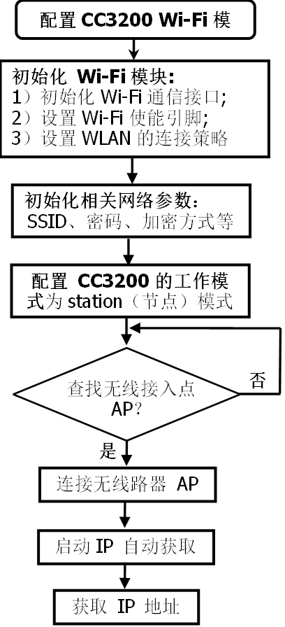

CC3200 片上 Wi-Fi 模块驱动的主要接口函数:

| 序号 | 接口函数名                                                   | 函数功能描述                                               |
| ---- | ------------------------------------------------------------ | ---------------------------------------------------------- |
| 1    | void WiFi_Initial(void)                                      | 初始化 CC3200 Wi-Fi 模块                                   |
| 2    | long ConfigureSimpleLinkToDefaultState()                     | 配置 CC3200 恢复到其默认的状态                             |
| 3    | int sl_Start ( const void* pIfHdl, char* pDevName, const P_INIT_CALLBACK pInitCallBack) | 启动 Wi-Fi 设备：初始化 Wi-Fi 通信接口，设置Wi-Fi 使能引脚 |
| 4    | int sl_WlanSetMode ( const unsigned char mode)               | 设置 CC3200 的 Wlan 工作模式                               |
| 5    | int  sl_WlanConnect (char* pName,  int  NameLen,   unsigned char *pMacAddr,  SlSecParams_t* pSecParams ,   SlSecParamsExt_t*  pSecExtParams) | CC3200 以 Station 模式连接到 WLAN 网络                     |
| 6    | int sl_Stop ( unsigned short timeout )                       | 停止Wi-Fi功能：清除相关使能的引脚、关闭通信接口            |

### 低功耗软件设计与实现

报警装置属于嵌入式移动设备采用锂电池供电，每个报警装置传感节点的体积较小，通常只能携带能量十分有限的电池。因此，在设计时必须对系统的功耗进行严格的控制。

报警装置传感节点的能量消耗主要包括：传感器模块、处理器模块和 Wi-Fi 无线通信模块。另外，系统的低功耗不仅取决于硬件，更重要的是合理的软件设计。此项目通过对 CC3200 微控制器的合理控制、Wi-Fi 模块低功耗的使用、并通过合理的软件结构设计，尽可能地降低系统的总体功耗。

**（1）微控制器 CC3200 的低功耗应用**

在设计中，为了使 CC3200 微控制器的功耗达到最低，结合了以下几种控制方式：

- CC3200 微控制器的休眠模式选择功耗最低的深度睡眠模式；

- 进入深度睡眠模式之前，禁用未使用的功能模块及时钟模块，进一步降低功耗；

- 微控制器的工作频率越高、使能的时钟模块越多，则功耗越大。故在系统进入深度睡眠模式后，只剩下一个 RTC 的时钟仍在工作，其时钟源选用的是频率最小的 32.768 KHz 振荡器，使功耗得到进一步降低；

- 使能 IO 口外部中断。只有发生相关中断时，才将微控制器从休眠模式中唤醒；

- 报警装置在不进行数据采集和数据通信时，尽可能地让 CC3200 微控制器进入深度睡眠模式，使其功耗达到最低；

**（2）CC3200 片上 Wi-Fi 模块的低功耗应用**

随着集成电路和工艺的进步，处理器和传感器模块的功耗变得很低。因此，绝大部分电量消耗在 Wi-Fi 无线通信模块上。Wi-Fi 无线通信模块存在四种状态：发送、接收、空闲和休眠。其中无线通信模块在空闲状态时，一直监听无线信道的使用情况，检查是否有数据发送给自己；而在休眠状态下，则是关闭通信模块，其能量消耗最少。

在设计中，为了使 CC3200 片内 Wi-Fi 模块的功耗达到最低，需要尽可能多地让 Wi-Fi 模块处于禁用状态。报警装置只有在需要与云服务器进行数据通信时，才使能 W-Fi 模块；其他情况下都将关闭 Wi-Fi 模块。

**（3）三轴加速度传感器 BMA222 的低功耗应用**

在设计中，结合 BMA222 的传感器的特点功能，给出了以下几种控制方式：

- 利用 BMA222 传感器内部的分析装置（中断功能），取代微控制器执行密集的数据采集，从而使微控制器可以在大部分时间里处于低功耗模式，可大幅度地减少系统功耗。

- 合理地配置 BMA222 的采样率。BMA222 在执行一个完整的操作，电流消耗仅为139μA（2 kHz数据速率情况下）。

- 只使能要用的 BMA222 的检测功能模块，禁用其他功能模块，进一步减少传感器产生的功耗。

## 嵌入式云服务器的设计与实现

### 客户端与云服务器数据交互的结构 

此次设计中，报警装置客户端与云服务器、手机客户端与云服务器的数据交互方式都采用 C/S（客户端/服务器）点对点的架构模型。在Emlab 嵌入式系统实验室开发的物联网云服务平台上，进一步开发用于此报警系统的云服务器，即实现一个通过 HTTP 协议的 GET/POST 请求与客户端进行动态数据交互的 Web 服务器系统。

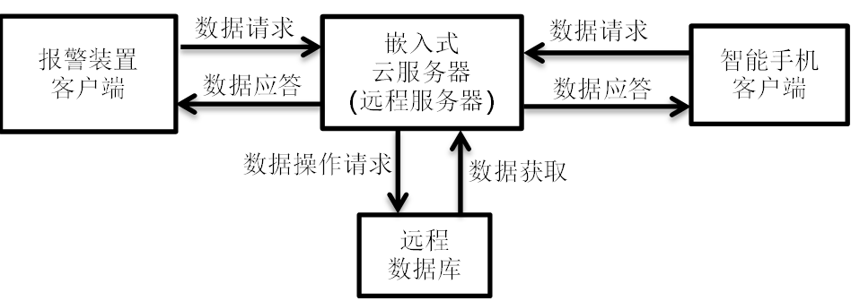

### 云服务器的详细设计和实现

此次设计中，将使用 Emlab 嵌入式系统实验室开发的物联网云服务平台。通过对 Web 服务器相关技术的研究，在此物联网云服务平台上，进一步开发用于此报警系统的云服务器，即实现一个通过HTTP 协议的GET/POST 请求与客户端进行动态数据交互的Web 服务器系统。

Web 服务器解析 HTTP 协议，并提供一个可以执行服务器端程序和返回响应的环境[19][20]。当 Web 服务器接收到一个 HTTP 请求，服务器只是单纯地把请求传递给可以很好处理请求的程序（例：服务器端脚本），再由服务器端程序执行相关的事务处理、数据库连接和消息等功能，最后返回相应的 HTTP 响应，将 HTML 数据返回给请求端。

此次设计的Web 服务器采用 PHP 语言开发，使用 MySQL 作为数据库。软件开发环境选择 Windows + Apache + PHP + MySQL 架构。


## 基于 Android 平台实时报警系统的设计与实现

此次设计将利用 Android 智能手机开发平台，开发手机客户端应用软件（APP），实现一种基于 Android的报警系统手机客户端。手机客户端主要实现以下功能：

- 手机客户端直接与云服务器进行通信，接收云服务器发送过来的报警信息；

- 手机客户端接收到报警信息后，进行相关的报警操作；

- 同时管理多个报警装置（传感节点）。

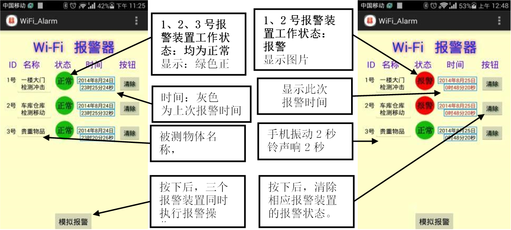


# 系统测试结果及分析

通过具体实例对整个报警系统进行综合测试和分析。此次报警系统的整体实物图，图左边设备为无线路由器；图中间设备为此次设计的报警装置；图右边设备为此次测试所使用的Android 手机。

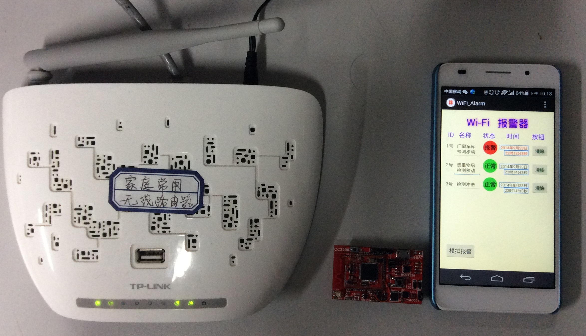

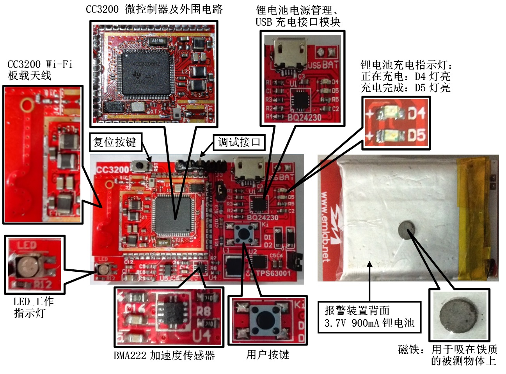

## 报警装置的功耗测试

报警装置完成一次报警操作时所产生的功耗波形图：

- ①为未发生报警时报警装置处于低功耗休眠状态；
- ②为报警从休眠状态下唤醒阶段；
- ③、④、⑤和⑥为 Wi-Fi 功能模块的启动使能阶段；
- ⑦为 Wi-Fi 发送报警信息阶段；
- ⑧为发送完报警信息，关闭Wi-Fi模块阶段；
- ⑨为完成报警操作后，返回低功耗休眠状态；
- 因此，完成一次报警操作，所消耗功耗包括阶段②～⑧，总花费约 2.7 秒的时间。

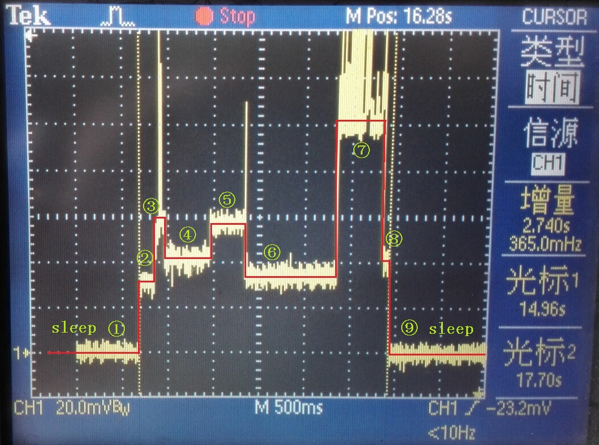

由上述测试结果：

- 可知报警装置工作在低功耗的休眠模式，三轴加速度传感器的功耗很小，所以这部分功耗非常少（平均电流在uA级）；
- 报警装置的 Wi-Fi 通信模块在工作时所消耗的功耗较大，Wi-Fi 模块激活工作时，平均电流约为 39 mA（瞬时电流可达 200 mA）；
- 并且，在 Wi-Fi 模块发送报警信息时的功耗最大。
- 每次Wi-Fi激活工作时间主要取决于无线路由器和网络状态（加入网络、安全认证、DHCP、DNS、数据传输等），一般在2~4秒之间。

## 锂电池电量使用分析

此次设计所使用的锂电池型号为 603048A，容量为 900 mA。测试结果表明：当被测物体越少被移动（无报警出现）时，系统的平均功耗就越低。因此，根据报警的间隔时间和电池容量，报警装置可工作数周至数月，可以满足一般应用要求。

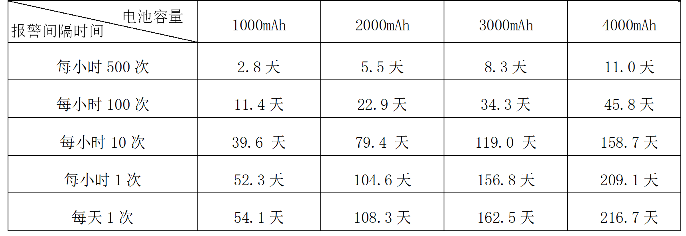

## 系统整体功能测试

通过对整个报警系统的功能进行测试，验证系统的整体功能是否达到预期的要求。下面将以一个报警应用实例对此次设计的报警系统进行综合测试，利用一台 Android 手机 APP 同时管理 3 个报警装置。

由于报警装置背面的电池上装有一个小磁铁，并且体积小、重量轻，故报警装置的安装相当简便，可将报警装置通过磁铁直接吸在被测物体的铁门上。测试所用的 3 个报警装置，分别安装在以下三个被测物体上。

- 01号报警装置：安装在实验室大门后，监测实验室大门是否被打开；

- 02号报警装置：安装在储物柜铁门上，监测储物柜是否被打开；

- 03号报警装置：安装在抽屉里面，监测抽屉是否被打开。

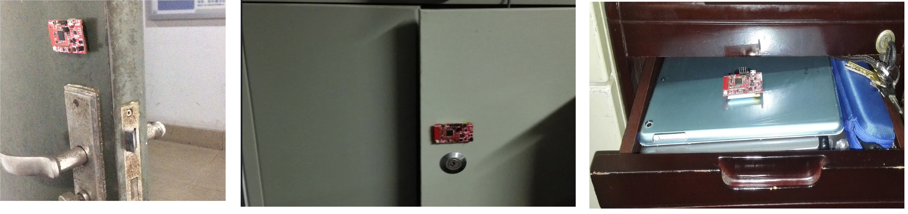

布置完报警装置节点后，打开 3 个报警装置的电源开关。报警装置将通过 Wi-Fi 自动连接到无线路由器发出的 AP（热点），并通过路由器链接到云服务器。

演示实例为：当实验室门被人打开时，手机 APP 上的 01号报警装置就会执行相应的报警操作。具体报警操作，如图所示。

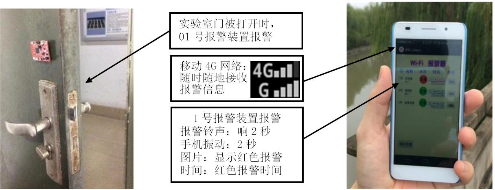


# 联系方式 & 感谢
维护：createshare@163.com 
主页：

DIY 开源项目仓库：

- https://github.com/createshare/DIY__wi-fi_alarm_CC3200
- https://gitee.com/createshare/DIY__wi-fi_alarm_CC3200

